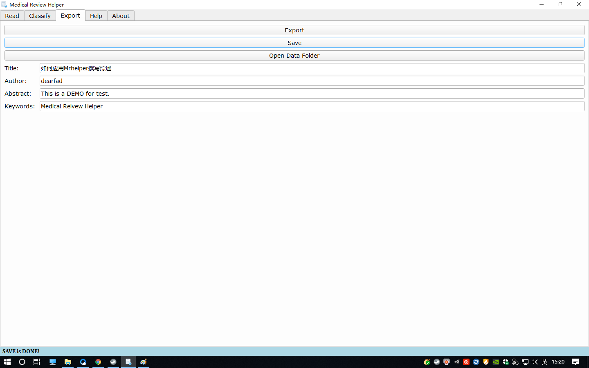
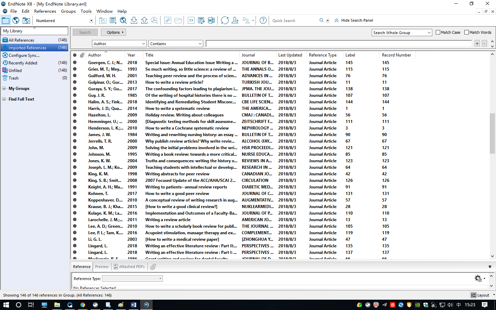

# QUICKSTART

```python
from Poppy import Hammer
# reader.eyes.setClosed(True)
Hammer.hold(time(3))
print('Just For Fun')
Hammer.R
```

## STEPS

### DATA PREPARATION

* **WOS**: Core Database -> Search -> Save to other format -> All Records and References -> Download

* **Pubmed**: Search -> Sent to -> File -> Format(MEDLINE) -> Create File -> Download

* **Wanfang**: 检索 -> 全选 -> 全选 -> 全选 -> 全选 -> ... -> 导出 -> NoteExpress -> 下载

* **CNKI**: 检索 -> 全选 -> 全选 -> 全选 -> 全选 -> ... -> 导出 -> CNKI E-Study -> 下载

### BEFORE START

* **New** -> **Save** xxx.mrh -> **Add** datafile...

### STEP 1 - READ


### STEP 2 - MARK


### STEP 3 - CLASSIFY


### STEP 4 - EXPORT



### STEP 5 - ENDNOTE



### STEP 6 - WORD


### STEP 7 - FORMAT


```python
import brain
import hand

while doc.isFinished():
    brain.think()
    hand.input()

print('Well Done!')
```

```html
<br><h2 align=center>Medical Review Help</h2>
<h3 align=center>医学综述助手</h3><br>
<div align=center><b>使用流程：</b><br>
<table><td>
<b>Step 1</b>: 点击新建或者打开按钮选择项目文件<br>
<b>Step 2</b>: 点击添加按钮选择数据库文件<br>
<b>Step 3</b>: 在<b>阅读</b>界面阅读并标记文献<br>
<b>Step 4</b>: 在<b>整理</b>界面调整分组及文献顺序<br>
<b>Step 5</b>: 在<b>导出</b>界面设置导出综述文档及数据文件<br>
<b>Step 6</b>: 使用<b>Endnote</b>新建数据库并以<b>Endnote Import</b>导入save目录下数据文件<b>endnote.txt</b><br>
<b>Step 7</b>: 设置ENDNOTE -> Edit -> Preferences -> Temporary Citation -> Use Field (勾选) -> Label<br>
<b>Step 8</b>: 使用<b>Word</b>打开save目录下综述文档<b>reference.docx</b>，在Endnote栏下将Instant Formatting is <b>Off</b>更改为<b>On</b><br>
<b>Step 9</b>: <b>保存</b>综述文档<br>
</td></table>
</div>
```